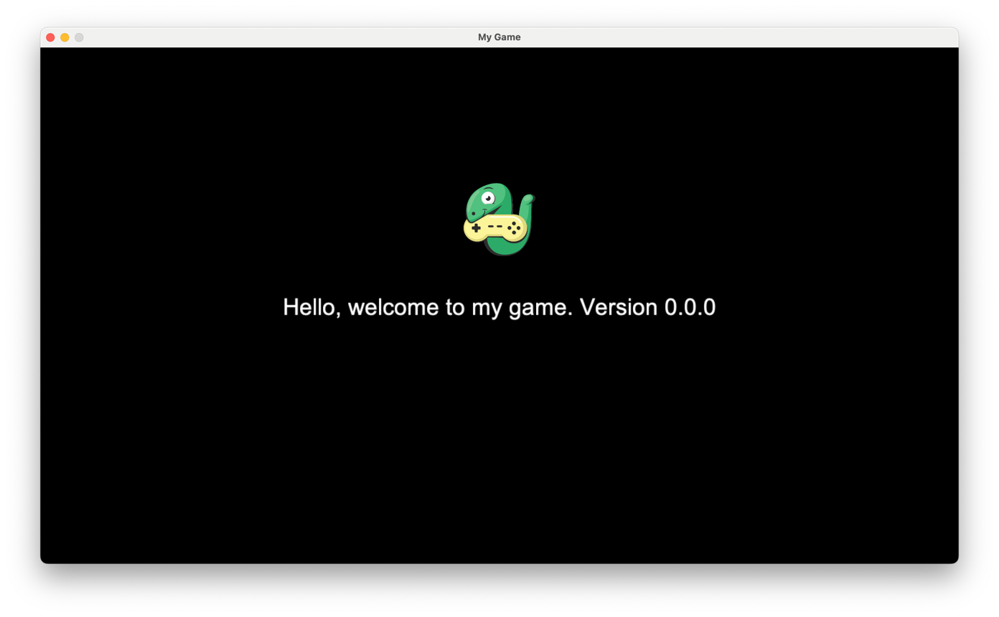

# Arcade New Game Template

A template for creating games with Python Arcade. 
Including workflows to build for MacOS, Linux, Windows.

## Getting started

> This setup uses uv, a tool which reduces the hazzle of setting up Python to a single command.
> [Install uv](https://docs.astral.sh/uv/getting-started/installation/)

1. Clone/Download this repository
2. Install the dependencies using `uv sync`
   This will ensure the required Python version and install the dependencies in a virtual
   environment.
3. RUn the game using `uv run python -m mygame`

## Project structure

- `mygame/` contains the game code
- `mygame/resources/` contains the game assets (images, sounds, etc.)
- `mygame/__main__.py` is the entry point of the game
- `mygame/version.py` provides the version of the game
- `mygame/utils` contains utility functions especially for frozen applications (PyInstaller,
  cx_freeze)

### Game code

The code for your first view is located in the `mygame/__init__.py`.
It is recommended to create further separate files and directories while the game grows.

## Workflows

This setup makes use of GitHub actions.
You can use the `release` action to release a new version.
That will trigger the `publish` action to build the game for MacOS, Linux and Windows.

The `release` workflow requires you to set the `DEPLOY_KEY` secret in your repository settings.

> GitHub Actions comes with included minutes, so you can use this setup for free.
> The workflows require a few minutes, so you should not exceed the included minutes.
> 
> Please ensure that you are not surprised by any costs.
> [More information](https://docs.github.com/en/billing/managing-billing-for-your-products/managing-billing-for-github-actions/about-billing-for-github-actions#included-storage-and-minutes)

### Add required deploy key

1. Generate a new SSH key pair
   ```bash
   ssh-keygen -t rsa -b 4096 -C "GITHUB Deploy Key" -f deploy_key -N ""
   ```
2. Add the public key to your repository settings
    - Go to your repository settings
    - Click on `Secrets`
    - Click on `New repository secret`
    - Name the secret `DEPLOY_KEY`
    - Paste the content of the public key file `deploy_key.pub` into the value field
3. Add the private key to your repository settings
    - Go to your repository settings
    - Click on `Deploy keys`
    - Click on `Add deploy key`
    - Name the key `GitHub Actions Deploy Key`
    - Paste the content of the private key file `deploy_key` into the key field
    - Check the `Allow write access` checkbox
    - Click on `Add key`
4. Delete the key files from your local machine
   ```bash
   rm deploy_key deploy_key.pub
   ```

### Create a new release

- Go to the `Actions` tab in your repository
- Click on `Release` in the left sidebar
- Click on `Run workflow`
    - Choose the version increment (major, minor, patch)
    - Click on `Run workflow`

### Package details

The `publish` workflow will create artifacts for each platform.
For MacOS and Windows we use cx_freeze, because it is less often detected as virus compared to
PyInstaller artifacts.
For Linux we use PyInstaller, because it is easier to set up and use.